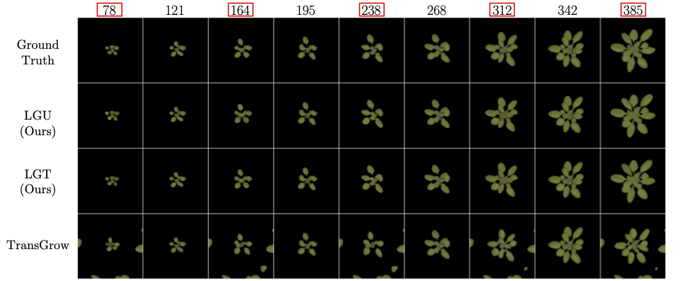

# Deep Learning Based Growth Modeling of Plant Phenotypes



This repository is dedicated to the master's thesis titled "Deep Learning Based Growth Modeling of Plant Phenotypes". 
The software included in this package utilizes deep learning models to simulate the growth of plants based on image data. 
The methodology employed here is based on the concept of modeling plant growth in the latent space of a pre-trained autoencoder.

## Installation
Installation of this package is done by simply cloning the repository.

Please make sure that you have installed all the necessary [requirements](requirements.txt):

```
pip install -r requirements.txt
```

## Usage
The basic usage of the models in the `dlbpgm` package is as follows, whereby the inputs have to be replaced by real images and timestamps.
```python
import torch
from dlbpgm.models import LGU

model = LGU(
    resolution=256, 
    ckpt_path="checkpoints/lgu256.pt"  # adjust path if needed
)

# Image input of shape [B, N, C, H, W]
x_in = torch.rand(1, 4, 3, 256, 256)
# Corresponding timestamps of shape [B, N]
t_in = torch.randint(0, 100, (1, 4))
# Desired output timestamps of shape [B, M]
t_out = torch.randint(0, 100, (1, 3))

# Predict images of shape [B, M, C, H, W]
x_out = model(x_in, t_in, t_out)
```
Checkout [notebooks](notebooks) for more detailed examples for training, inference, and data-preprocessing.
